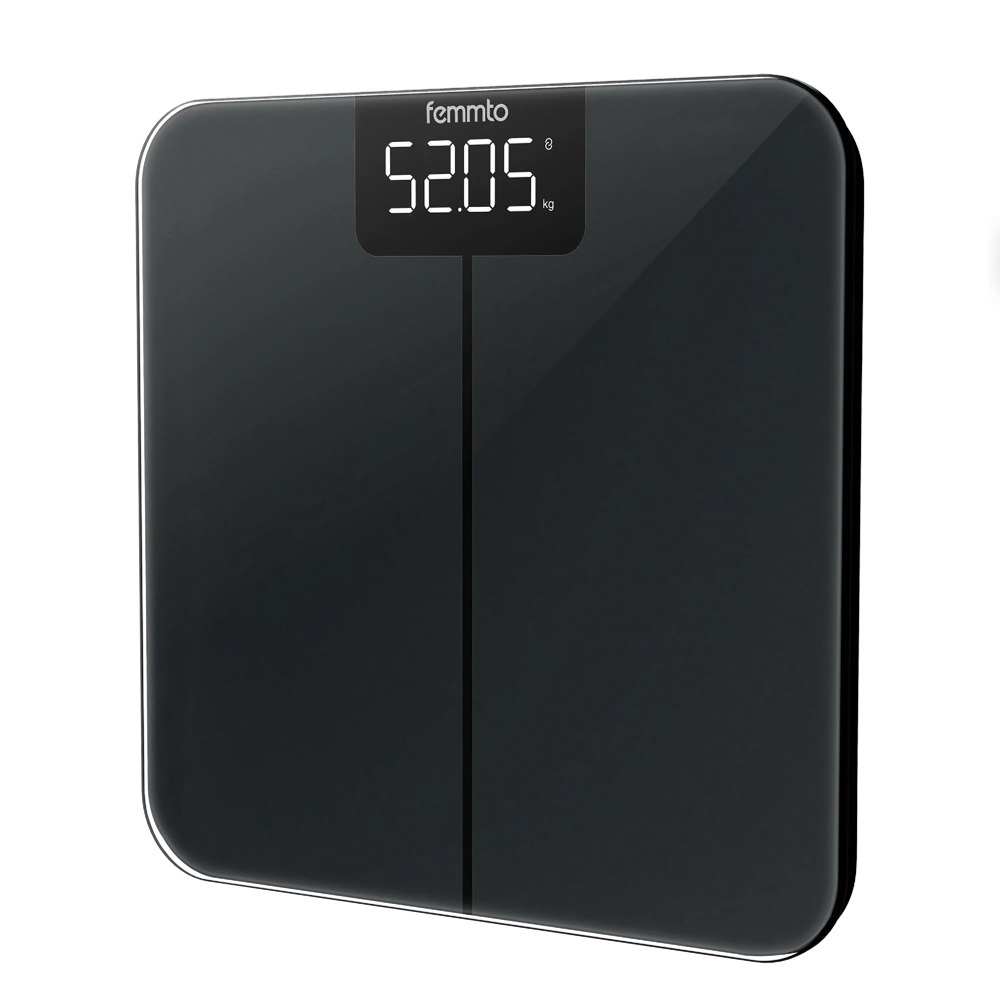

# Femmto Scale BLE Home Assistant Custom Integration

This integration aims to interface a generic simple Bluetooth Scale, Femmto BWS12 (also known as Femmto Isora) to Home Assistant using bluetooth.
In conjunction with bodymiscale integration it works as a powerful weight tracking sensor without needing to use the brand app which requires creating an account and having accessible a mobile phone.

